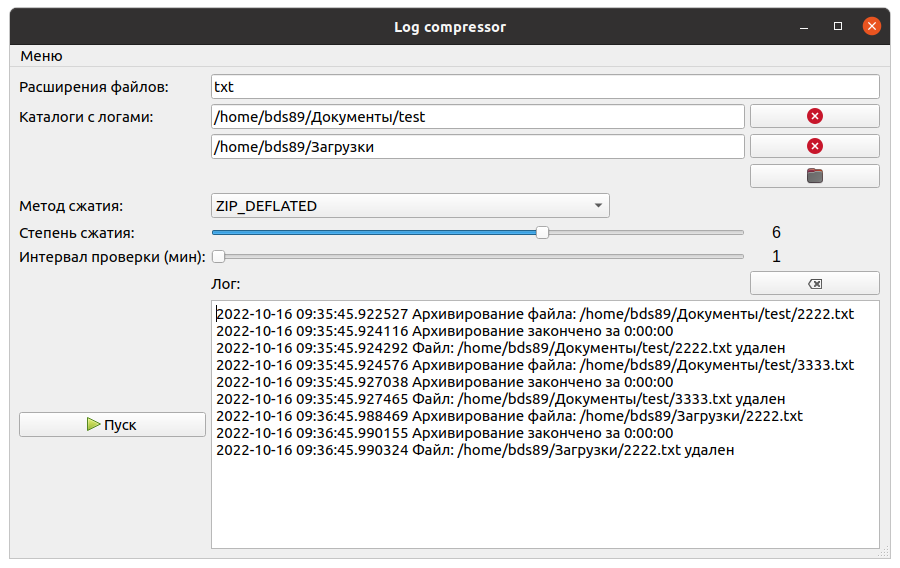

# LOG compressor

Автоматически сжимает и удаляет файлы в заданных директориях с заданным расширением и заданным интервалом проверки

## Описание
На работе попросили написать простенькое приложение, для сжатия тяжеловесных логов и удаления оригиналов.

Возможности:
- Выбор нескольких директорий с логами
- Выбор расширений сжимаемых файлов
- Выбор метода и степени сжатия
- Возможность свернуть в трей

Приложение кросплатформенное, запускать командой `python3 'Log compressor.py` для Windows есть готовый файл 'Log compressor.exe`